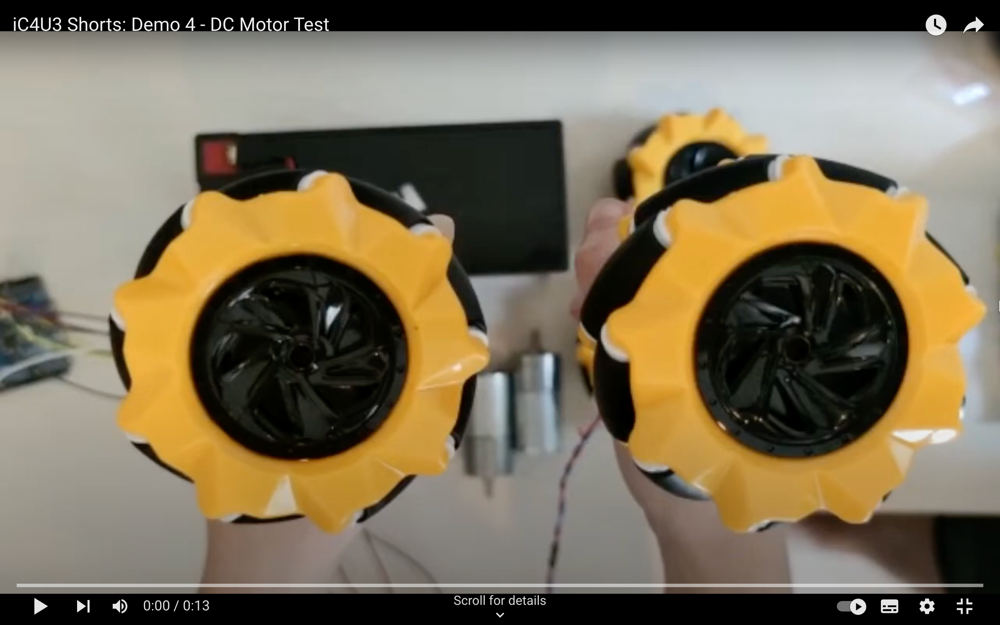

# IC4U's Mecanum Library

Mecanum Motor Library in action with this demonstration video:



To see more of IC4U, visit my [YouTube channel](https://www.youtube.com/@Selinoid).

---

## Overview

The Mecanum Motor Library is a Python library designed for controlling Mecanum wheels or motors using the Adafruit TB6612 motor controller. The library allows easy and efficient control of Mecanum wheels, enabling omnidirectional movement for your robotics projects.

## Installation

To use the Mecanum Motor Library, you need to have Python and the RPi.GPIO library installed on your Raspberry Pi. You also need the Adafruit TB6612 library, which can be installed using pip:

```bash
pip install adafruit-circuitpython-motorkit
```

Next, place the TB6612Library.py and MecanumLib.py files in the same directory as your project.

```bash
git clone https://github.com/saornek/IC4Us-Mecanum-Library.git
```

## Usage
Here's a simple example of how to use the Mecanum Motor Library to control a robot with Mecanum wheels:

```python
from MecanumLib import *

# Initialize the motor controller
frontLeft = Motor(17, 27, 22, 8, False)
frontRight = Motor(26, 6, 13, 8, False)
backLeft = Motor(12, 5, 24, 8, False)
backRight = Motor(11, 10, 9, 8, False)

# Move the robot forward at 50% speed for 2 seconds
forward(50)
time.sleep(2)

# Stop the robot
stop()
```
## Warning
The movement configurations provided in the Mecanum Library code may vary depending on the physical placement and connection of the motors in your specific robot. The code assumes a IC4U's motor arrangement based on the provided GPIO pin numbers, but the physical arrangement of your motors may differ. Therefore, before using the library, ensure that you have correctly identified the correct motor placements.

To avoid unexpected behavior or damage to your robot, it is crucial to carefully review the motor connections and placements in your robot's hardware setup. If your motor arrangement differs from the default configuration assumed by the library, you may need to modify the code accordingly.

## Reference
### Motor class
#### Motor(in1, in2, pwm, standbyPin, reverse)
The Motor class represents a motor connected to the Adafruit TB6612 motor controller.

* **in1:** GPIO pin number for IN1.
* **in2:** GPIO pin number for IN2.
* **pwm:** GPIO pin number for PWM.
* **standbyPin:** GPIO pin number for the standby pin.
* **reverse:** Boolean indicating whether the motor's polarity is reversed.

#### forward(speed)
Move the motor forward at the specified speed.

* **speed:** A value between 0 and 100 representing the speed of the motor.

#### backward(speed)
Move the motor backward at the specified speed.

* **speed:** A value between 0 and 100 representing the speed of the motor.

#### stop()
Stop the motor.

#### brake()
Apply the brake to the motor.

#### standby(value)
Set the standby mode for the motor.

## Contributions
Contributions to this project are welcome! If you find any issues or have suggestions for improvements, feel free to open an issue or submit a pull request on the GitHub repository.

## Support
For any questions or support related to this library, you can contact me via the repository issues page.
